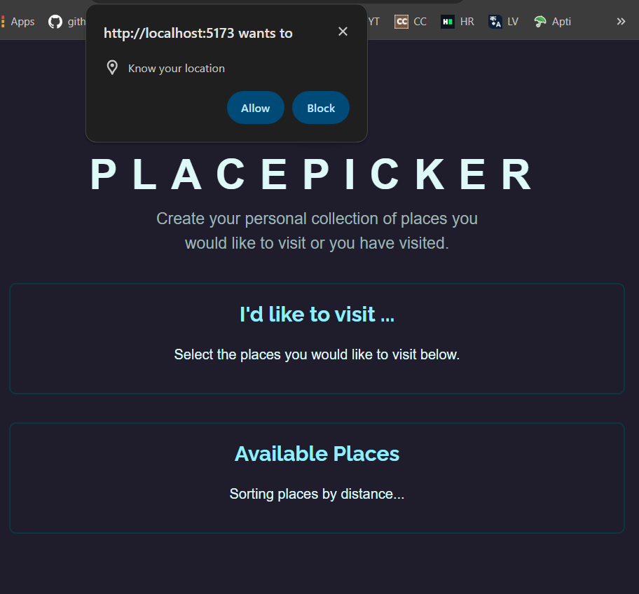
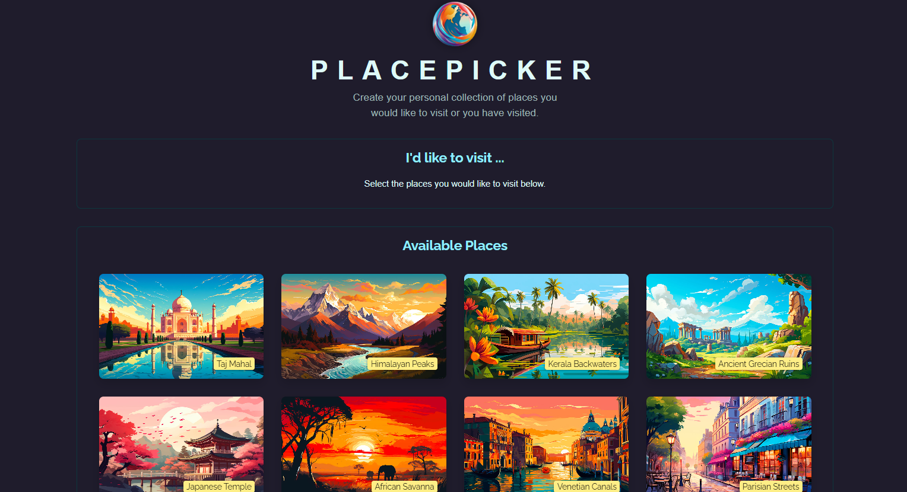

# PlacePicker

PlacePicker is a React-based application designed to help users manage and organize their collection of places they wish to visit or have visited. The application offers functionalities for selecting, organizing, and removing places, along with features such as geolocation-based sorting and a delete confirmation modal.

## Components

### DeleteConfirmation

Provides a confirmation dialog for deleting a selected place.

**Props**:
- `onConfirm`: Function triggered when the delete action is confirmed.
- `onCancel`: Function triggered when the delete action is canceled.

### Modal

Creates a modal dialog for displaying content or confirming actions.

**Props**:
- `open`: Boolean indicating whether the modal should be open or closed.
- `children`: Content to be displayed within the modal.
- `onClose`: Function triggered when the modal is closed.

### Places

Displays a list of places, either picked by the user or available for selection.

**Props**:
- `title`: Title of the section.
- `places`: Array of places to be displayed.
- `fallbackText`: Text to be displayed when there are no places available.
- `onSelectPlace`: Function triggered when a place is selected.

### ProgressBar

Displays a progress bar indicating the remaining time for an action.

**Props**:
- `timer`: Duration of the timer in milliseconds.

## Screenshots

*Screenshot 1: Geolocation Request*

*Screenshot 2: Available Places*

*Screenshot 3: To-Go Places*

## How to Use

1. **Setting Up**
   - Clone this repository to your local machine.
   - Navigate to the project directory.

2. **Installation**
   - Run `npm install` to install dependencies.

3. **Running the Application**
   - Execute `npm start` to start the development server.
   - Access the application at `http://localhost:3000`.

4. **Usage**
   - Browse available places and select those of interest.
   - Use the delete confirmation dialog to confirm place removal.
   - View available places sorted by distance.

## Dependencies
- React
- ReactDOM

## Notes
- Uses localStorage to store selected places.
- Geolocation feature sorts available places by distance.

